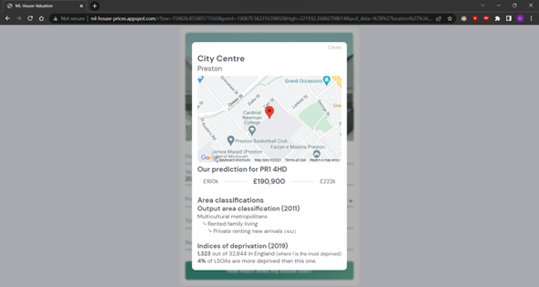

# ml-house-prices
A-Level Machine Learning project, predicts the price of properties given location, square footage, number of rooms etc.
Created dataset from various sources including the HM Land Registry, EPC data, ONS Postcode Lookup.
Implemented (from scratch):
- Multiple Linear Regression
- Decision Tree
- Multilayer Perceptron (achieved 0.83 R2-score) including Adam optimisation and backpropagation for the learning algorithm.

## Screenshots

